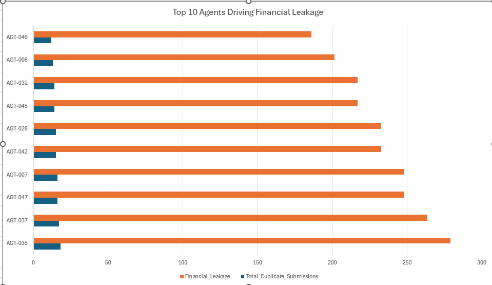

# Operational Duplicate Detection and Cost Leakage Analysis

## Project Overview
In data operations, duplicate records don't just skew reporting—they can lead to direct financial loss. This project simulates a real-world scenario where field agents submit duplicate address verification jobs, resulting in unnecessary payouts. 

By combining Python for data generation, SQL for anomaly detection, and Excel for executive reporting, I built a complete workflow to detect duplicate logic, quantify the exact revenue leakage, and identify the root cause.

## Business Problem Addressed
* **Financial Leakage:** Paying agents multiple times for the same verification job.
* **Process Inefficiency:** Lack of automated validation logic allowing duplicate submissions to enter the payment pipeline.
* **Vendor Management:** Needing to identify which specific agents are driving the highest error rates or fraudulent submissions.

## Executive Summary & Analysis Results
The SQL analysis successfully identified duplicate verification jobs that bypassed standard validation. By quantifying this, I uncovered the following key metrics:
* **Total Duplicate Verification Jobs:** 500
* **Total Estimated Financial Leakage:** ₦7,750.00

Further root cause analysis revealed that a small cluster of field agents drove the majority of these errors. For instance, **AGT-035** alone was responsible for 18 duplicate submissions, resulting in ₦279.00 of leakage.

*(See the chart below for the breakdown of the Top 10 Agents driving cost leakage)*

## Core Analysis Workflow
1. **Data Generation:** Created a dataset mimicking field agent submissions (`Verification_ID`, `Agent_ID`, `Payment_Amount`).
2. **Duplicate Detection Logic:** Wrote SQL queries utilizing `GROUP BY` and `HAVING COUNT(*) > 1` to flag repeated entries.
3. **Revenue Leakage Quantification:** Calculated the exact dollar amount lost by multiplying the standard payment rate by the number of invalid, repeated submissions.
4. **Root Cause Analysis:** Aggregated the financial loss by `Agent_ID` to pinpoint the specific individuals driving the leakage.

## Tools & Technologies
* **Python (Pandas, Numpy):** Data generation and simulation.
* **SQL (SQLite):** Common Table Expressions (CTEs) and aggregation for duplicate isolation and financial loss calculation.
* **Microsoft Excel:** Data summarization and executive visualization.

## Files in this Repository
* `Duplicate_Detection_SQL_Analysis.ipynb`: The complete Python and SQL script used to generate the data and run the analysis.
* `raw_agent_verifications.csv`: The initial messy dataset containing the hidden duplicates.
* `agent_leakage_summary.csv`: The clean, aggregated output from the SQL query.
* `top_10_agents_chart.png`: The visual dashboard summarizing the leakage.

## Data Validation Recommendations
To prevent this recurrence, I recommend implementing a unique constraint on the `Verification_ID` column in the primary database and adding a pre-submission validation check in the agent portal to block duplicate entries before they process.
